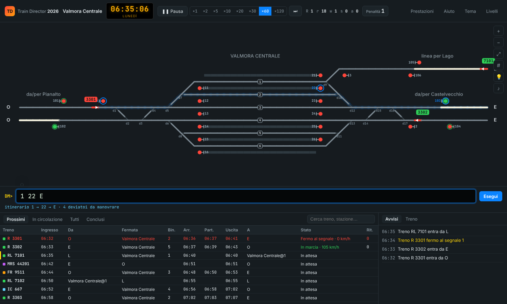

# Train Director 2026

Simulatore di **dirigente movimento** ispirato a [Train Director](https://www.backerstreet.com/traindir/it/trdirita.php) di Giampiero Caprino.
Hai davanti il quadro luminoso della stazione (in stile ACEI) e, sotto, l'orario dei treni.
Il tuo lavoro è formare gli itinerari in tempo, così che ogni treno arrivi al binario giusto e riparta in orario.

Rispetto all'originale, i comandi non si danno più cliccando su segnali e scambi uno per uno.
Si **digitano i "pulsanti"** in una barra comandi, come sul banco di un apparato ACEI: digiti il segnale d'inizio e quello di fine itinerario e il gioco manovra da solo i deviatoi necessari.



## Come si gioca

Apri `TrainDirector2026.html` con un doppio clic: è un unico file e non va installato nulla.
In alternativa, da sviluppatore: `npm install` e poi `npm run dev`.

1. Scegli un livello (o importa uno scenario originale, vedi sotto).
2. Premi **Invio a barra vuota** per avviare il tempo (di nuovo Invio per la pausa).
3. Quando un treno si avvicina, forma l'itinerario digitando i pulsanti separati da spazi.

| Comando | Effetto |
|---|---|
| `1 3` | Itinerario dal segnale 1 al segnale 3: manovra i deviatoi e dispone l'1 a via libera |
| `3 E` | Dal segnale 3 verso l'uscita E |
| `1 3 E` | Catena di itinerari in un solo comando |
| `2 b5` | Ricevi sul **binario 5** (indispensabile nelle stazioni di testa); anche `2 @5` |
| `1 b2 E` | Attraversa la stazione dal binario 2 e prosegui verso E |
| `12` | Apre o chiude il solo segnale 12 |
| `x 12` | Annulla l'itinerario (segnale 12 a via impedita) |
| `a 31` | Blocco automatico sul segnale 31 |
| `d4 d5` | Manovra i deviatoi 4 e 5 |
| `BC-PN` | Attiva un itinerario predefinito (negli scenari importati) |
| `inv 2291` · `man 2291` · `parti 2291` | Inverti la marcia · manovra a 30 km/h · partenza anticipata |
| `ass 2290 2291` | Assegna il materiale di un treno arrivato a un altro treno |
| `info 2291` | Scheda del treno |
| `v 30` · `pausa` · `avvia` · `salta` | Velocità del tempo, pausa, avvio, salto al prossimo evento |
| `1 3; 6 O` | Più comandi nella stessa riga |

Mentre scrivi, l'itinerario viene **mostrato in anteprima** sul quadro e sotto la barra compare l'esito previsto: quanti deviatoi verranno manovrati, oppure perché non si può formare.
Funzionano anche **Tab** (completa), **↑/↓** (cronologia) ed **Esc** (cancella).
Un clic su segnale, deviatoio o uscita aggiunge il relativo pulsante alla barra; Shift+clic esegue l'azione direttamente, come nel programma originale.

Con la barra vuota, l'**assistente DM** (💡) propone i comandi utili per i treni in arrivo: un clic e il comando è nella barra.

### Colori del quadro

- **bianco**: itinerario formato (bloccato)
- **rosso**: binario occupato da un treno
- **grigio**: binario libero
- segnali: **verde** = via libera, **giallo** = via libera con avviso di via impedita al segnale successivo, **rosso** = via impedita; un anello attorno al segnale indica il blocco automatico

### Penalità

Le penalità sono le stesse del Train Director originale: destinazione errata, binario errato, treni in ritardo, treni fermi ai segnali, comandi rifiutati, scambi manovrati o segnali aperti inutilmente, fermate saltate.
Le trovi in **Prestazioni**.

## Livelli

| Livello | Descrizione |
|---|---|
| 1 · Borgo San Rocco | Stazione di incrocio su linea a binario unico. È il tutorial. |
| 2 · Valmora Centrale | Grande stazione passante con 6 binari e doppio binario con comunicazioni, più la diramazione a binario unico per Lago |
| 3 · Porto Alba Marittima | Stazione di testa con 8 binari tronchi: tutti i treni invertono la marcia e ripartono |

Ogni livello è verificato da un test automatico: l'assistente DM lo porta a termine senza destinazioni né binari errati.

## Scenari originali di Train Director

Dalla schermata iniziale puoi **importare** uno scenario di Train Director 3: il `.zip` intero, oppure i file `.trk` + `.sch` (più le icone `.xpm`).
Il gioco legge il formato originale: tracciato, orario, itinerari predefiniti, icone, giorni di circolazione (`When:`), ritardi casuali (`!`), orari relativi (`+`), materiale (`Wait:` / `Stock:`) e ingressi o uscite alternativi (`|`).
È stato provato con *Milano Porta Garibaldi 2025* e *Torino 2026*.

Limite noto: gli **scritti** (`.tds`, linguaggio di scripting di TD) non vengono eseguiti.
I segnali di avviso, i ripetitori e gli indicatori vengono riconosciuti dal nome del file di script (o dal contenuto, se il `.tds` è nel pacchetto) e non arrestano i treni; gli altri segnali si comportano come segnali normali.

## Salvataggio

La partita si salva da sola nel browser.
Viene salvata la sequenza dei comandi, che alla ripresa viene rigiocata in modo deterministico, come il "replay" dell'originale.
Dalla schermata iniziale: **Riprendi**.

## Per sviluppatori

```
npm install
npm run dev        # server di sviluppo
npm test           # test (motore, livelli, barra comandi)
npm run build      # crea dist/index.html e TrainDirector2026.html (file unico)
```

- `src/core/` — motore senza dipendenze dal browser: geometria dei binari (`geom.ts`, tabelle portate da TrackShape.cpp), parser `.trk`/`.sch`, sezioni di blocco e ricerca itinerari (`paths.ts`), simulazione (`sim.ts`), barra comandi (`commands.ts`), assistente (`assist.ts`)
- `src/ui/` — quadro su canvas, tabella orari, pannelli
- `src/scenarios/` — livelli integrati, scritti con un piccolo costruttore che produce file `.trk` veri

## Licenza

GPL v2 (vedi `LICENSE`), come il Train Director originale, da cui derivano le tabelle di instradamento dei binari e la logica di simulazione.
